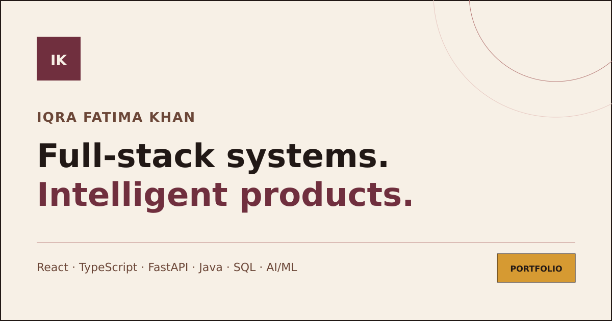
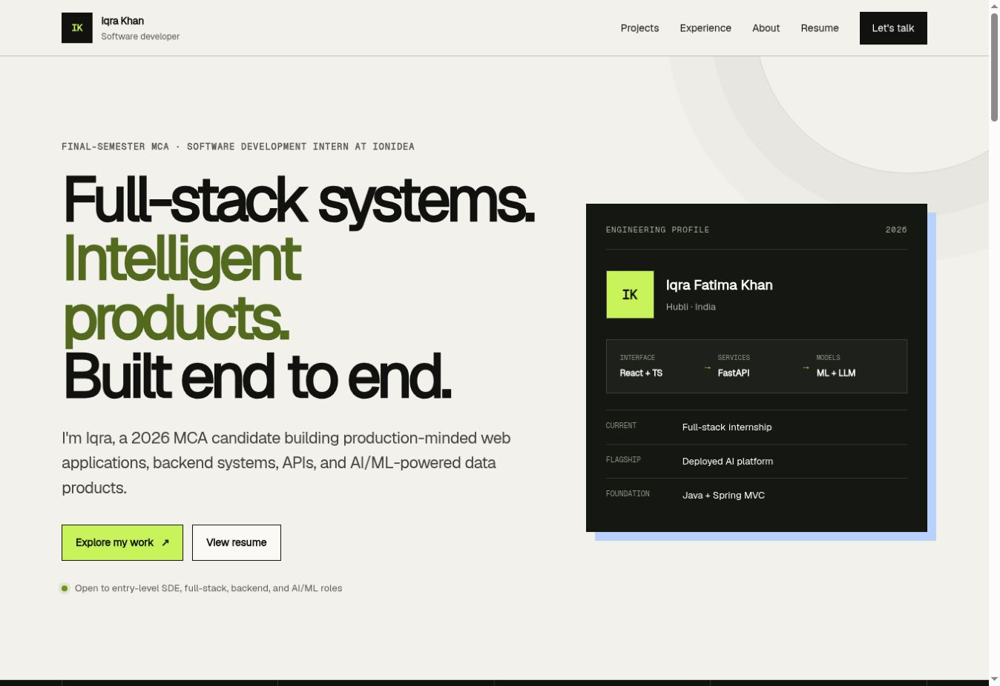

<div align="center">



# Iqra Fatima Khan | Software Developer Portfolio

Evidence-led case studies across full-stack engineering, backend systems, Java and applied AI/ML.

[](https://iqra-khan-portfolio-self.vercel.app)
[](https://vercel.com/new/import?s=https%3A%2F%2Fgithub.com%2FIqraaaakhan%2FIqra-Khan-Portfolio)
[](https://linkedin.com/in/iqra-khan-540420265)
[](https://github.com/Iqraaaakhan)

</div>

## About the portfolio

This portfolio is designed for fast recruiter review while still giving engineering work enough depth. It leads with verified product evidence, explains architecture and trade-offs, and keeps all public internship material non-confidential.

## Featured engineering work

| Project | What it demonstrates | Links |
| --- | --- | --- |
| **Enverse** | React, TypeScript, FastAPI, JWT and OTP authentication, forecasting, anomaly detection, energy analytics and a multilingual data-grounded assistant | [Case study](https://iqra-khan-portfolio-self.vercel.app/projects/enverse) · [Live app](https://enverse-blue.vercel.app/) · [Repository](https://github.com/Iqraaaakhan/Enverse) |
| **DarkSky Observation System** | Java, Spring MVC, JDBC, MySQL, JSP, Maven, session authentication and Controller-Service-DAO separation | [Case study](https://iqra-khan-portfolio-self.vercel.app/projects/darksky) · [Repository](https://github.com/Iqraaaakhan/DarkSky-Observation-System) |
| **KLEver** | PHP, MySQL, AJAX, OTP authentication, search, cart, Razorpay checkout, order tracking and admin workflows | [Case study](https://iqra-khan-portfolio-self.vercel.app/projects/klever) · [Repository](https://github.com/Iqraaaakhan/KLEver) |

## Preview

<p align="center">
  
</p>

## Stack

- Next.js App Router with native Vercel production builds
- Vinext and Cloudflare-compatible local/Sites runtime
- React 19 and TypeScript
- Tailwind CSS v4 build pipeline with a custom global visual system
- Cloudflare-compatible Sites deployment

No application backend, database, analytics tracker, or contact-form service is required.

## Local setup

Requirements:

- Node.js 22.13 or newer
- npm

```bash
npm install
npm run dev
```

Open the local URL shown by the development server.

To run the native Next.js development server used by Vercel:

```bash
npm run dev:vercel
```

## Quality checks

```bash
npm run lint
npx tsc --noEmit
npm run build:vercel
```

The Vercel production build validates the native Next.js application.

## Project structure

```text
app/
  about/                 About page
  contact/               Contact page
  experience/            Experience page
  projects/              Project index and case studies
  resume/                Browser-viewable resume
  components.tsx         Shared layout and portfolio components
  data.ts                Typed profile, project, and experience content
  globals.css            Responsive visual system
  layout.tsx             Global metadata and layout
  robots.ts              Crawler rules
  sitemap.ts             Search-engine route map
public/
  media/                 Click-to-play product demo media
  profile/               Explicitly approved About portrait
  projects/              Optimized repository and user-supplied screenshots
  resume/                Downloadable resume PDF
```

## Accessibility

- Semantic landmarks and heading order
- Skip link and visible keyboard focus
- Keyboard-usable navigation
- High-contrast text and controls
- Descriptive image alternatives
- Responsive reading widths and touch targets
- Reduced-motion support
- No animation-dependent information
- No autoplaying media
- Full-size image access through keyboard-usable links
- Privacy-safe public resume copy with the personal phone number removed

## SEO

- Route-specific titles and descriptions
- Open Graph and social preview metadata
- Person and SoftwareApplication structured data
- Robots and sitemap metadata routes
- Descriptive URLs and headings
- Optimized WebP screenshots

The default canonical origin is the production Vercel portfolio URL. Set `NEXT_PUBLIC_SITE_URL` only when moving to a future custom domain.

## Deployment

The production portfolio is deployed at [iqra-khan-portfolio-self.vercel.app](https://iqra-khan-portfolio-self.vercel.app). The included `vercel.json` supplies its native Next.js build settings, and pushes to `main` deploy automatically.

The current ChatGPT Sites deployment can remain online as a fallback while the Vercel deployment is verified. Vercel provides a clean `vercel.app` address even without a purchased domain.

For a custom domain:

1. Add the domain through the hosting provider.
2. Configure the requested DNS records.
3. Set `NEXT_PUBLIC_SITE_URL` to the exact `https://` origin.
4. Redeploy and verify the canonical URLs, sitemap, Open Graph image, resume, and project links.

## Updating the portfolio

To add or revise a project:

1. Update the typed project entry in `app/data.ts`.
2. Add an optimized screenshot under `public/projects/`.
3. Add a case-study route under `app/projects/<slug>/`.
4. Use exact source-backed metrics and state evaluation boundaries.
5. Add the route to `app/sitemap.ts`.
6. Run lint, TypeScript checking, and `npm run build:vercel`.

## Continuous integration

GitHub Actions runs linting, TypeScript checking and the production build on pushes and pull requests to `main`.

## License

The source code is available under the MIT License. Personal resume content, written case-study content, and project screenshots remain the property of Iqra Fatima Khan and their respective project owners and are not granted for reuse as identity or portfolio content.
